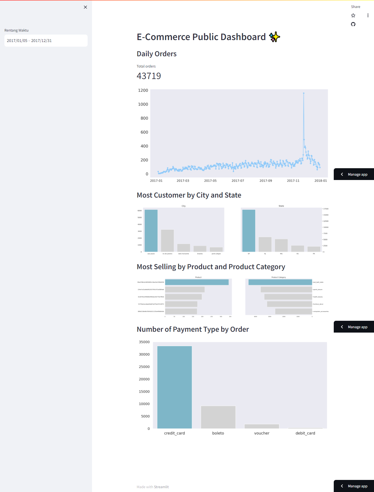

# E-Commerce Public Dashboard ✨

## Setup environment

```
conda create --name main-ds python=3.9
conda activate main-ds
pip install numpy pandas matplotlib seaborn jupyter streamlit
```

## Run steamlit app

```
streamlit run dashboard.py
```

## Streamlit Dashboard Preview

https://e-commerce-public.streamlit.app/


